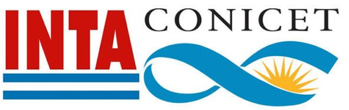
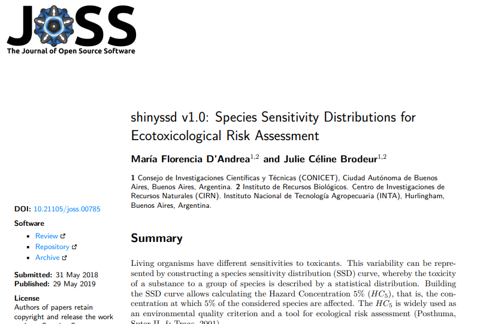
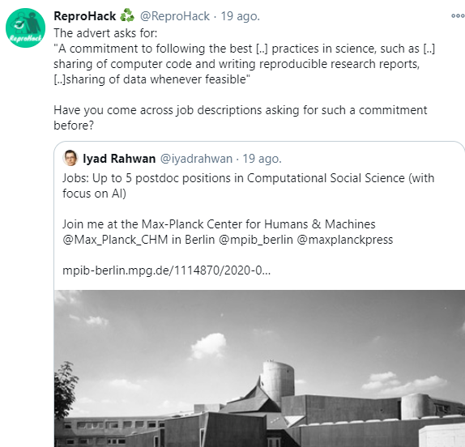
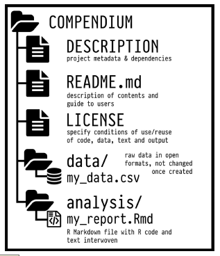
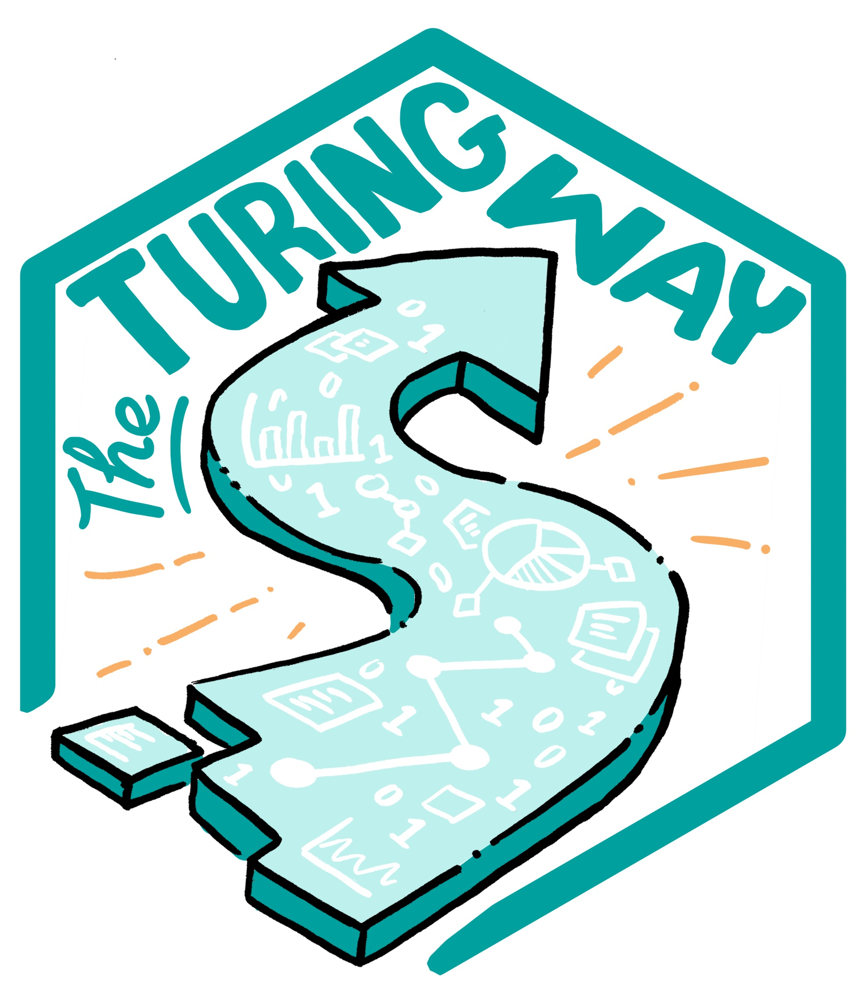

```{r setup, include=FALSE}
options(htmltools.dir.version = FALSE)
```

```{r xaringan-themer, include=FALSE, warning=FALSE}
library(xaringanthemer)
library(xaringanExtra)
library(tidyverse)
library(knitr)
library(icon)
library(nomnoml)
library(countdown)
xaringanExtra::use_logo(
  image_url = "https://raw.githubusercontent.com/rstudio/hex-stickers/master/PNG/xaringan.png"
)
xaringanExtra::use_panelset()
xaringanExtra::use_broadcast()
xaringanExtra::use_share_again()
xaringanExtra::style_share_again(share_buttons = c("twitter", "linkedin"))
xaringanExtra::use_tachyons()
xaringanExtra::use_fit_screen()
xaringanExtra::use_tile_view() # O
style_mono_accent(
  background_color = "#ffffff",
  inverse_background_color = "#007D95",
  header_color = "#2C2788",
  inverse_header_color = "#DEDCDD", 
  inverse_text_color = "#DEDCDD",
  code_inline_color = "#179c55",
  link_color= "#BF0002",
  text_font_size = "25px",
  header_font_google = google_font("Poppins", "Regular", "400"),
  text_font_google   = google_font("Darker Grotesque", "500"),
  code_font_google   = google_font("Fira Mono"),
  )

```


class: inverse, middle, center

`r countdown(minutes = 5)`


### Empezamos en 5 minutos
Tenes tiempo para irte a buscar el ☕ o preparar el agua para el 🧉

---

class: inverse, center, middle

### Seminario del Instituto de Recursos Biológicos del INTA

¡Los estabamos esperando!

---

background-image: url(imagenes/1.png)
background-size: cover
class: inverse

### Produciendo mi próximo artículo científico con R:
#### Compendios de Investigación, Reproducibilidad e Interactividad en las publicaciones académicas

```{r logos, echo = FALSE, out.width=100}



```

 .large[#### Dra. Florencia D'Andrea | Instituto de Recursos Biológicos | 2 de diciembre 2020]


---

class: center, middle, inverse


### Licencia

<a rel="license" href="http://creativecommons.org/licenses/by/4.0/"></a><br />Este obra está bajo una <a rel="license" href="http://creativecommons.org/licenses/by/4.0/">licencia de Creative Commons Reconocimiento 4.0 Internacional</a>

---

class: inverse, middle, center

## ⚠
### ¡Atención! 
#### El foco de esta charla esta en el software y los datos 

---

class: center, middle

```{r researchc, echo = FALSE, out.width=800}
knitr::include_graphics("imagenes/ResearchCycle.jpg")
```


---
# Definición
### Software para investigación

.bg-washed-green.b--dark-green.ba.bw2.br3.shadow-5.ph4.mt5[
"Software que se utiliza para generar, procesar o analizar los resultados para una **publicación** (ya sea en una revista, artículo de conferencia, monografía, libro o tesis)"]

.footnote[Hettrick *et al.* (2014)]

---

### Desafio: Dejando software y datos disponibles

> **Ciencia abierta** es la práctica de dejar "los resultados primarios de investigaciones financiados con fondos públicos, los artículos y los datos sean accesibles al público en formato digital sin restricciones o con una restricción mínima".


.footnote[[The Turing Way Checklist](https://the-turing-way.netlify.app/reproducible-research/open/open-resources.html) / 
[OECD (2015)]()]

---
## Principios FAIR
#### Ciencia tan abierta como sea posible, tan cerrado como sea necesario” (abierto por defecto)

```{r research, echo = FALSE, out.width=700}
knitr::include_graphics("imagenes/FAIRprinciples.jpg")
```
]

.footnote[[Library Carpentry](https://librarycarpentry.org/lc-fair-research/01-introduction/index.html)
]]]

---

class: middle, inverse

### 👉 **Reproducibilidad** 

### Compendio de investigación

### Interactividad


---
# Reproducibilidad

```{nomnoml echo=FALSE, svg= TRUE, fig.width = 10, fig.align = "center"}
# direction: down | center 
#.resaltado: fill=#8f8 title=bold

[Reproducibilidad] -> [ Empírica]
[Reproducibilidad] -> [ <resaltado> Computacional]
[Reproducibilidad] -> [ Estadística]

```

.footnote[Stodden et al. 2014]
---


## Software y datos abiertos

* Los **datos** son hechos u observaciones que proporcionan **evidencia**. 

* El **software** es el resultado de un proceso creativo que **proporciona una herramienta** para hacer algo, por ejemplo, con datos.

*->* El software es ejecutable.

*->* El software a menudo se crea con otro software.

.footnote[Towards FAIR principles for research software]

---

class: center, middle, inverse

## ¿Es suficiente compartir el código y los datos para que otros puedan reproducir mis análisis?

---


---

class: center, middle, inverse

### En mi computadora pude reproducir mis resultados
### ¿puedo considerar que mi trabajo es reproducible? 

---

## ¿Qué pasa de acá a 10 años?

```{r nt, echo=FALSE, out.width=400, fig.align='center'}
knitr::include_graphics("imagenes/nature1.png")
```

.footnote[[Artículo de Nature](https://www.nature.com/articles/d41586-020-02462-7)]

---

# Experiencia previa: publicación de código

```{r joss, echo = FALSE, out.width=700}

```
.footnote[D’Andrea (2019). Journal of Open Source Software, 4(37), 785, https://doi.org/10.21105/joss.00785]


---

class: center, inverse, middle
# Ciencia **abierta** y **reproducible**

---


# ¿Un cambio cultural?

.pull-up[
```{r cd, echo=FALSE, out.width=400, fig.align='center'}
knitr::include_graphics("imagenes/codecheck.png")
```
.footnote[[Codecheck](https://www.nature.com/articles/d41586-020-02462-7)]
 ]
 
.pull-down[
```{r cd2, echo=FALSE, out.width=700, fig.align='center'}
knitr::include_graphics("imagenes/codecheck2.png")
```

]

---

# ¿Un cambio cultural?

```{r tw, echo=FALSE, out.width=600,fig.align='center'}

```

.footnote[[Twitter ReproHack](https://www.nature.com/articles/d41586-020-02462-7)]

---

# Reproducibilidad computacional

```{r repro, echo = FALSE, fig.align='right'}
knitr::include_graphics("imagenes/CultureShift.jpg")
```
.footnote[[Scriberia](https://www.nature.com/articles/d41586-020-02462-7)]


---


class: inverse, middle, center
# 🙌👩‍💻
# ¡Manos a la obra!

---
class: inverse, middle, center
## ¿En qué estoy trabajando?

---

## Postdoc 

> #### Desarrollo de herramientas informáticas para evaluar el riesgo de las aplicaciones de plaguicidas para los ecosistemas acuáticos


```{r pc, echo=FALSE, fig.align='center'}
#knitr::include_graphics("imagenes/flyer.png")
```

---
class: middle, center
> Mi trabajo implica usar **modelos** que simulan el destino ambiental de los **plaguicidas** luego de su aplicación. 

> En particular, el modelo que uso permite estimar concentraciones de plaguicidas en **cuerpos de agua superficiales**

```{r pampa, echo=FALSE, fig.align='center'}
knitr::include_graphics("imagenes/lagunas.png")
```
.footnote[Imagenes tomadas por [Julie Brodeur]()]
---

## Evaluación de Riesgo Ecotoxicológico (ERE)

Riesgo de aplicaciones de **plaguicidas** sobre la **biota acuática**

```{nomnoml echo=FALSE, svg= TRUE, fig.width = 10, fig.align = "center"}
# direction: down | center 
#.resaltado: fill=#8f8 title=bold

[ERE] -> [<resaltado>caracterización de exposición | concentraciones de plaguicida]
[ERE] -> [caracterización de efecto | concentraciones relevantes toxicológicamente]

```

El riesgo se estima de la comparación ente ambas concentraciones

---
## Mi próxima publicación  

.bg-washed-green.b--dark-green.ba.bw2.br3.shadow-5.ph4.mt5[

Statistically-based soil-climate scenarios for aquatic pesticide fate modelling and exposure assessment in the Pampa Region of Argentina.

]

---

# Bases de datos

Empleo distintas bases de datos:

* Suelo
* Fenología
* Hidrología
* Clima
* Propiedades de plaguicidas

```{nomnoml echo=FALSE, svg= TRUE, fig.width = 10}

# direction: down | center 
#.rlang: fill=#8f8 visual=ellipse title=bold

[base de datos 1] 
[base de datos 2] 
[base de datos *n*] 
```


---

# Modelo

**Pesticide Water Calculator v1.52** (USEPA)
 
Automatización de corridas: 
117000 simulaciones =  30 años `*`  50 plaguicidas `*` 78 suelos - clima 


```{nomnoml echo=FALSE, svg= TRUE, fig.width = 10, fig.align="top"}

# direction: down | center 
#.high: fill=#8f8 title=bold

[base de datos 1] --> [<high>Modelo PWC]
[base de datos 2] --> [<high>Modelo PWC]
[base de datos *n*] --> [<high>Modelo PWC]
```

---

# Resultados

¡Una nueva base de datos!

```{nomnoml echo=FALSE, svg= TRUE, fig.width = 10,fig.align="top"}

# direction: down | center 
#.high: fill=#8f8 title=bold

[base de datos 1] --> [Modelo PWC]
[base de datos 2] --> [Modelo PWC]
[base de datos *n*] --> [Modelo PWC]
[Modelo PWC] -> [<high>Resultados]
```

---

# Las Figuras

Proceso los resultados con R. 

```{nomnoml echo=FALSE, svg= TRUE, fig.width = 10, fig.align="top"}

# direction: down | center 
#.rlang: fill=#8f8 visual=ellipse title=bold
#.high: fill=#8f8 title=bold

[base de datos clima] --> [Modelo PWC]
[base de datos suelo] --> [Modelo PWC]
[base de datos moléculas] --> [Modelo PWC]
[Modelo PWC] -> [Resultados]
[Resultados] - [<rlang> R]
[<rlang> R] -> [<high>Gráficos]
[<rlang> R] -> [<high>Tablas]
[<rlang> R] -> [<high>Mapas]

```


---

class: inverse, middle, center

## ¿Y ahora? Publicar

---

```{r journey, echo = FALSE, out.width=700, fig.align='center'}
knitr::include_graphics("imagenes/ReproducibleJourney.jpg")
```


class: middle, center

.bg-washed-green.b--dark-green.ba.bw2.br3.shadow-5.ph4.mt5[
####"El hecho de que un análisis sea reproducible **no garantiza su calidad**, que este sea correcto o la validez de los resultados publicados" - Peng (2011)

]


---
# Programación literaria

### RMarkdown (.Rmd)


---


# Reproducibilidad computacional

.panelset[
.panel[.panel-name[¿Qué es?]

.bg-washed-green.b--dark-green.ba.bw2.br3.shadow-5.ph4.mt5[

 Cuando se proporciona información detallada sobre código, software, hardware y detalles de implementación.

.tr[
 Stodden, 2014
]]
 
]

.panel[.panel-name[Ejemplos]


]

.panel[.panel-name[Entornos]

*  session.info()
* "Empaquetar" los datos
*  Paquetes de manejo de dependencias (renv)
*  Notebooks interactivas (Binder / RStudio Cloud)

Recomiendo, esta charla que dí en R-Ladies BA
]
]

.footnote["Más información en el siguiente link"]


---

class: inverse, middle, center

## ¿Qué usamos para asegurar la reproducibilidad de los artículos científicos?

---


.bg-washed-green.b--dark-green.ba.bw2.br3.shadow-5.ph4.mt5[
"El software (...) con frecuencia se desarrolla para permitir el uso de otro software, lo que genera dependencias complejas, y estos paquetes de software dependientes cambian a su vez con frecuencia"]

.footnote[Katz 2016]


---

### Entorno computacional 

Características de una computadora que pueden afectar el comportamiento del trabajo realizado en ella, como:
* su **sistema operativo**
* qué **software** tiene instalado 
* las **versiones de paquetes** de software están instaladas

.footnote[The Turing Way]
---

# Algunas opciones para capturar entornos

* paquete `renv`
* Binder
* Docker container

---

## Más sobre entornos

[Post](https://florencia.netlify.app/es-es/2020/08/compartiendo-entornos-interactivos-y-reproducibles-en-r-con-binder.es-es/) sobre Binder en R-Ladies BA (incluye charla)

```{r binder, echo=FALSE}
knitr::include_url("https://flor14.github.io/r_de_reproducibilidad/r_de_reproducibilidad.html#1")
```

---


## Mejora mi flujo de trabajo


* Mi proyecto esta organizado

* No tengo problema en compartirlo con quien quiera.

---

## Los datos y el software se citan
#### Autores de artículos
* Citar datos y software que usas
* Publica tu propios datos y software y citalos también
* Obtené un ORCID id

--
#### Para quienes generan datos
* Depositalos en un repositorio "estable" 
* Obtené un DOI
* Incluí un ejemplo de cómo citarlo en el README


.footnote[[The Turing Way - Credit for reproducible research](https://the-turing-way.netlify.app/reproducible-research/credit.html?highlight=cite%20data)]


---
## Los datos y el software se citan
#### Para quienes desarrollan software

* Deposite versiones clave de su software en un repositorio estable

* Obtenga un DOI distinto para cada versión

* Incluya un ejemplo de cómo citar su software en el manual o documentación

#### Ejemplo
v1.0 (specific version): 10.5281/zenodo.60943
v1.1 (specific version): 10.5281/zenodo.800648
Concept (all versions): 10.5281/zenodo.705645

.footnote[[The Turing Way - Credit for reproducible research](https://the-turing-way.netlify.app/reproducible-research/credit.html?highlight=cite%20data) / [Zenodo - DOI versioning](https://help.zenodo.org/#versioning)]

---

```{r doiversion, echo = FALSE, out.width=900, fig.align='center'}

knitr::include_graphics("imagenes/zenodo_versioning.png")
```
.footnote[[Zenodo - Zenodo now supports DOI versioning!](https://blog.zenodo.org/2017/05/30/doi-versioning-launched/)]

---

class: middle, inverse

### Reproducibilidad

### 👉 **Compendio de investigación**

### Interactividad

---

## Compendio de investigación

.pull-left[

* **Organizar los archivos** de acuerdo a una convención prevalente.

* Proveer **separación entre los datos, métodos y salidas** expresando sin ambiguedades la relación entre las tres.

* Especificar el entorno (+ **reproducibilidad**).

.footnote[Marwick 2018]
]

.pull-right[
```{r rc, echo = FALSE, out.width=500}

knitr::include_graphics("imagenes/ResearchCompendium.jpg")

```
]


---

## Compendio de investigación
#### Estructura

.pull-left[

Otra persona pueda saber que encontrar por los nombres de los archivos y directorios. 

**Marwick(2018)** Utilizar la estructura de un paquete de R

Crea el paquete `rrtools`
]

.pull-right[
```{r rc2, echo = FALSE, out.width=400}



```
]

---
class: middle, center, inverse
> "introducen el concepto de compendio como contenedor de los diferentes elementos que componen el documento y sus cálculos (es decir, texto, código, datos, ... ), y como medio de distribución, gestión y actualización de la colección "


.footnote[Gentleman, R. y Temple Lang, D. (2004) ]
---

## Paquete `rrtools` 

Tutorial 

```{r rclogo, echo = FALSE, out.width=100}

```

* Archivo `README.md` que describe el proyecto

*  Programación literaria (`RMarkdown`)

* Estructura de paquete (Archivo DESCRIPTION con las dependencias)

* Manejo de bibliografía integrado (`citr`)

`r icon::fa("folder")`

---

### ¿Cómo compartir un Compendio de investigación?

.panelset[

.panel[.panel-name[Licencia]

* **Incluir un archivo con la licencia** indica a los demás cómo puede ser reutilizado tu trabajo.

* Los **datos** y las **figuras** podrian tener diferentes licencias.

--

```{r usethis, echo = FALSE, out.width=50}
knitr::include_graphics("imagenes/usethis.png")
```

El paquete `usethis` incluye funciones que agregan la licencia que elijas a tu proyecto:

```{r usethis2, eval=FALSE, include=TRUE}
library(usethis)
usethis::use_mit_license("Florencia D Andrea")
```
]

.panel[.panel-name[Control de versiones]

Sistemas de control de versiones como `Git` <ion-icon name="logo-octocat"></ion-icon> es la mejor manera de preservar el historial de cambios en el compendio de investigación.

* Facilita la colaboración privada entre colegas
sobre el proyecto 

* Facilita la distribución y mantenimiento del compendio en el futuro

]
.panel[.panel-name[Persistencia]

Asignarle una URLs permanente al repositorio como un `Digital Object Identifier (DOI)` `r icon::ai("doi")`  

* osf.io `r icon::ai("osf")`
 
* figshare.com  `r icon::ai("figshare")`

* zenodo.org <i class="ai ai-zenodo ai-3x"></i>
]
.panel[.panel-name[Metadata]

Cuando se genera un DOI para un repositorio también se debe proporcionar información básica de metadatos para un registro central que supervisa la creación de DOI:

* CrossRef (principalmente artículos de revistas) 

* DataCite (datos y otros productos) 

]

]

.footnote[Marwick(2018)]


---

## Dar crédito (al trabajo propio y ajeno)
#### Asignar un DOI

.panelset[
.panel[.panel-name[¿Qué es?]

]

.panel[.panel-name[Ventajas]

]

.panel[.panel-name[Pasos para obtenerlo]

]

.panel[.panel-name[Citando versiones]

]

]

---

## ¿Que agrego cuando agrego un compendio de investigacion?

```{nomnoml echo=FALSE, svg= TRUE, fig.width = 10}

# direction: down | center 
#.rlang: fill=#8f8 visual=ellipse title=bold
#.high: fill=#8f8 title=bold

[base de datos clima] --> [Modelo PWC]
[base de datos suelo] --> [Modelo PWC]
[base de datos moléculas] --> [Modelo PWC]
[Modelo PWC] -> [Resultados]
[Resultados] - [<rlang> R]
[<rlang> R] -> [Gráficos]
[<rlang> R] -> [Tablas]
[<rlang> R] -> [Mapas]
[<rlang> R] -> [<high>Compendio de investigación]

```


---

class: middle, inverse

### Compendio de investigación

### Reproducibilidad computacional

### 👉 **Interactividad**

---

## Comunicación de mis resultados

* Aplicación web (**shiny**)
* Gráficos interactivos (**plotly**)
* Papers interactivos y reproducibles (**stencila**)

---


## Shiny

.panelset[
.panel[.panel-name[¿Qué es?]

]

.panel[.panel-name[Ventajas]

]

.panel[.panel-name[Ejemplo]

App 1 - 

App 2-


]

]


---

## Gráficos interactivos
#### Plotly

.panelset[
.panel[.panel-name[¿Qué es?]

]

.panel[.panel-name[Ventajas]

]

.panel[.panel-name[Ejemplo]

]

]

---

class: inverse, middle, center

# Articulo reproducible
Mostrar que esto existe

[Artículo reproducible](https://elifesciences.org/articles/30274/executable)

[stenci.la](https://stenci.la/)


---

class: inverse, middle, center

# Mi trabajo

[Shiny app]()

[]()

---
class: inverse, middle, center

# Algunos lugares donde encontrar ayuda y buscar información

---

# ROpenSci

```{r ropen, echo = FALSE, out.width=300, fig.align='right'}
knitr::include_graphics("imagenes/ropensci.png")
```

[Web](https://ropensci.org/)


---

# The Turing Way

```{r open, echo = FALSE, out.width=300, fig.align='right'}

```

Libro de [The Turing Way](https://the-turing-way.netlify.app/welcome)

---

# ReproHack

```{r rh, echo = FALSE, out.width=300, fig.align='right'}
knitr::include_graphics("imagenes/reprohack.png")
```


---

# ReproHack en LatinR 2020

Lista de reproducción en YouTube con 6 charlas

```{r rhlr, echo=FALSE}
xaringanExtra::embed_xaringan(url = "https://flor14.github.io/latinr-reprohack/index.html#1")
```

---

```{r trt, echo=FALSE, out.height="600", out.width="500", fig.align='center'}
knitr::include_graphics("imagenes/toronto.jpg")
```


---
class: inverse

# Referencias
#### Principios FAIR / Ciencia Abierta / Reproducibilidad
* [The Turing Way book](https://the-turing-way.netlify.app/)

* [Lista de recursos sobre Research compendium](https://research-compendium.science/)
* [OECD (2015), “Making Open Science a Reality”](https://www.fct.pt/dsi/docs/Making_Open_Science_a_Reality.pdf), OECD Science, Technology and Industry Policy Papers, No. 25,
OECD Publishing, Paris. http://dx.doi.org/10.1787/5jrs2f963zs1-en

* Wilkinson, M., Dumontier, M., Aalbersberg, I. et al. The FAIR Guiding Principles for scientific data management and stewardship. Sci Data 3, 160018 (2016). https://doi.org/10.1038/sdata.2016.18

* [Principios FAIR](https://www.go-fair.org/fair-principles/)

* [Library Carpentry: FAIR Data and Software](https://librarycarpentry.org/lc-fair-research/)

* Data Citation Synthesis Group: Joint Declaration of Data Citation Principles. Martone M. (ed.) San Diego CA: FORCE11; 2014 [https://www.force11.org/group/joint-declaration-data-citation-principles-final].

* Katz DS, Niemeyer KE, Smith AM, Anderson WL, Boettiger C, Hinsen K, Hooft R, Hucka M, Lee A, Löffler F, Pollard T, Rios F. 2016. Software vs. data in the context of citation. PeerJ Preprints 4:e2630v1 https://doi.org/10.7287/peerj.preprints.2630v1

* [Improve your workflow for
reproducible science
Mine Çetinkaya-Rundel](https://mine-cetinkaya-rundel.github.io/improve-repro-workflow-reproducibilitea-2020/slides/improve-repro-workflow-reproducibilitea-2020.pdf) 

---
class: inverse

# Referencias
#### Reproducibilidad computacional
* [The Turing Way book](https://the-turing-way.netlify.app/)

* UseR 2020 

* Victoria Stodden. Edge.org. May 2014. [Online; accessed 27. May 2020]. URL: https://www.edge.org/response-detail/25340.

* Peng RD (2011), Reproducible Research in Computational Science. Science 334(6060): 1226–1227. doi:10.1126/science.1213847.

* The Turing Way Community, & Scriberia. (2020, March 3). Illustrations from the Turing Way book dashes. Zenodo. http://doi.org/10.5281/zenodo.3695300
---
class: inverse

# Referencias
#### Herramientas en R / COmpendios

Francisco 

Anna rrtools

drake

https://zenodo.org/communities/research-compendium/?page=1&size=20

---

class: inverse, center, middle

## ¡Muchas gracias por su atencion!

<br><br>
Dra. Florencia D'Andrea <br> **Investigadora postdoctoral** <br>
`r icon::fa("github")` [flor14]("http://github.com/flor14") <br>
`r icon::fa("twitter")` [cantoflor87]("http://twitter.com/cantoflor87")<br>
`r icon::fa("link")` [florencia.netlify.app/es-es/]("https://florencia.netlify.app/es-es/")<br>

 <br> <br>

 Filminas disponibles <https://flor14.github.io/seminario_irb_2020/presentacion.html#1> 

---